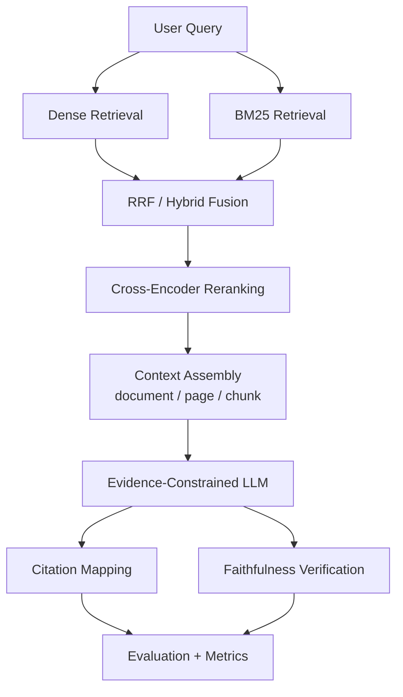

# Enterprise RAG / AI Search

> **Retrieval engineering for evidence-grounded LLM systems.** Dense + BM25 retrieval, RRF fusion, cross-encoder reranking, citation traceability, faithfulness verification, and reproducible evaluation.

Enterprise RAG is built around a simple principle:

> **Retrieve the evidence. Rank it. Cite it. Verify it. Measure it.**

This repository is more than a PDF chatbot. Retrieval, generation, citations, evaluation, persistence, and observability are separated so each layer can be tested and improved independently.

## Project status

**Current milestone: local retrieval-engineering benchmark hardening.**  
**Release status: research/engineering system — not production-ready.** Production deployment remains explicitly gated.

| Area | Status |
|---|---|
| Dense retrieval | Implemented |
| BM25 retrieval | Implemented locally |
| Hybrid / RRF | Implemented locally |
| Cross-encoder reranking | Implemented |
| Evidence-constrained generation | Implemented |
| Citation mapping / validation | Implemented |
| Faithfulness verification | Implemented |
| Evaluation harness | Implemented |
| Stable evidence metadata gate | COMPLETE |
| OCR fallback validation | COMPLETE |
| 50-query human-verified benchmark | Frozen |
| Human-verified gold labels | Complete — 780 judgments |
| Query rewriting experiment | Evaluated — mixed; feature flag remains off |
| Controlled retrieval results | Available in `data/evaluation/results/` |
| Production multi-tenant release | **GATED / NOT RELEASED** |

> **Integrity rule:** benchmark metrics are reported only with a frozen corpus, relevance judgments, configuration, and reproducible run. The query-rewrite comparison is separate from the original baseline.

## Architecture

The system is intentionally separated into ingestion, retrieval, ranking, evidence-grounded generation, citation verification, and evaluation so that each layer can be measured independently.

[](https://gitdiagram.com/eklakh-ai-engineer/enterprise-rag?utm_source=readme&utm_medium=badge)



**Retrieval path:** dense semantic retrieval and BM25 lexical retrieval are fused with RRF, then reranked before context assembly. The generation boundary receives retrieved evidence rather than unrestricted corpus access.

**Evidence path:** document/page/chunk provenance is preserved through generation, citations are mapped back to retrieved evidence, and faithfulness is evaluated separately from retrieval relevance.

**Implementation map:** [docs/ARCHITECTURE.md](docs/ARCHITECTURE.md) describes the implemented request pipeline, evidence model, generation/citation boundaries, observability, production boundary, and security constraints.

## What is engineered here?

### Retrieval
- Dense semantic retrieval with SentenceTransformers
- BM25 lexical retrieval for exact terms, identifiers, acronyms, and terminology
- Hybrid candidate fusion using RRF
- Configurable candidate and top-k selection
- Cross-encoder reranking

### Evidence and generation
- Context assembly preserves document/page/chunk provenance
- Evidence-constrained generation through an OpenRouter-backed provider interface
- Explicit insufficient-evidence behavior
- Strict [Source N] citation mapping
- Citation validity and citation accuracy treated as separate concepts
- Claim-level faithfulness verification

### Evaluation

    Retrieval quality
          ≠
    Generation quality
          ≠
    Citation quality
          ≠
    Faithfulness

The CHA benchmark is frozen at **50 corpus-derived queries across 10 categories** with **780 human judgments**. Its separate query-rewriting experiment showed mixed query/category outcomes and a small overall nDCG@10 regression; rewriting remains feature-flagged and disabled by default. See [docs/EVALUATION.md](docs/EVALUATION.md).


## Frozen 4-system benchmark — current evidence

The frozen CHA benchmark contains 50 corpus-derived queries and 780 human relevance judgments. The four systems below were evaluated with the same corpus, query set, labels, top-k=10, candidate-k=20, 10,000 bootstrap iterations, and seed=42. Values are mean with a 95% bootstrap confidence interval.

| System | Recall@5 | Recall@10 | MRR | nDCG@5 | nDCG@10 |
|---|---:|---:|---:|---:|---:|
| Dense | 0.327 [0.297, 0.356] | 0.491 [0.455, 0.529] | 1.000 [1.000, 1.000] | 0.724 [0.670, 0.776] | 0.699 [0.658, 0.739] |
| BM25 | 0.329 [0.292, 0.368] | 0.498 [0.457, 0.540] | 1.000 [1.000, 1.000] | 0.730 [0.678, 0.778] | 0.714 [0.669, 0.756] |
| Hybrid / RRF | **0.331 [0.291, 0.374]** | **0.540 [0.501, 0.581]** | 1.000 [1.000, 1.000] | **0.748 [0.697, 0.798]** | **0.747 [0.704, 0.788]** |
| Hybrid + Cross-Encoder | 0.314 [0.277, 0.353] | 0.511 [0.471, 0.551] | 1.000 [1.000, 1.000] | **0.755 [0.702, 0.805]** | 0.745 [0.702, 0.786] |

**Interpretation:** Hybrid's strongest evidence is deeper retrieval: Dense → Hybrid improves Recall@10 by +9.9% and nDCG@10 by +7.0%, with paired bootstrap CIs excluding zero. MRR is saturated and is therefore **not discriminative on this benchmark**. Reranking improves some queries but costs substantial latency and is not universally superior.

**Important:** these CIs describe the frozen 50-query benchmark. They do not establish generalization to harder or corpus-blind queries.

## Reproducibility configuration

| Layer | Frozen configuration |
|---|---|
| Python | 3.12 |
| Corpus | `CHA-POLICY-CORPUS-V1` |
| Query benchmark | `enterprise-rag-golden-v1-human-verified` / 50 queries |
| Chunking | `recursive-v2-span` |
| Dense embedding | `sentence-transformers/all-MiniLM-L6-v2` |
| Dense index | FAISS `IndexFlatIP` over normalized embeddings |
| Sparse retrieval | `rank-bm25==0.2.2` / Okapi BM25 |
| Hybrid fusion | Reciprocal Rank Fusion (RRF) |
| Candidate / final k | candidate-k=20 / top-k=10 |
| Cross-encoder | `cross-encoder/ms-marco-MiniLM-L-6-v2` |
| Retrieval bootstrap | 10,000 iterations, seed=42 |
| Generation model | OpenRouter model from `OPENROUTER_MODEL`; not part of retrieval benchmark |
| Faithfulness judge | OpenRouter model from `OPENROUTER_MODEL`; `faithfulness-v1`, temperature=0 |
| Dependency source | `requirements.txt` + `requirements-dev.txt` + `requirements.lock` |

`OPENROUTER_MODEL` must be recorded in any answer/faithfulness evaluation artifact; an unset or placeholder model is not reproducible.

## Repository structure

```text
ENTERPRISE-RAG/
│
├── app/                         # Backend application and domain logic
│   ├── api/                     # FastAPI routes and request boundaries
│   ├── parsing/                 # PDF extraction and OCR fallback
│   ├── chunking/                # Chunking + durable evidence spans
│   ├── ingestion/               # Document ingestion orchestration
│   ├── indexing/                # Index construction / persistence
│   ├── retrieval/               # Dense, BM25, hybrid retrieval
│   ├── reranking/               # Cross-encoder ranking
│   ├── generation/              # LLM provider + grounded generation
│   ├── citations/               # Citation extraction and mapping
│   ├── faithfulness/            # Claim/evidence verification
│   ├── evaluation/              # Evaluation primitives
│   ├── query/                   # Query pipeline orchestration
│   └── observability/           # Pipeline telemetry
│
├── data/
│   └── evaluation/              # Versioned benchmark contracts and labels
│
├── docs/
│   ├── README.md                # Documentation map
│   ├── ARCHITECTURE.md          # Current architecture
│   ├── EVALUATION.md            # Evaluation methodology + benchmark
│   ├── PROJECT_PLAN.md          # Active delivery roadmap
│   ├── DEVELOPMENT.md           # Local development workflow
│   ├── DEPLOYMENT.md             # Later production deployment
│   ├── DATABASE.md               # Production data model
│   ├── SECURITY.md               # Security baseline
│   ├── IMPLEMENTATION_PLAN.md    # Detailed implementation plan
│   └── history/                  # Superseded audits and historical snapshots
│
├── frontend/                    # React + Vite inspection UI
├── scripts/                     # Reproducible build/evaluation utilities
├── tests/                       # Canonical automated test suite
├── screenshots/                 # Working application evidence
├── supabase/                    # Database schema/migration artifacts
│
├── .env.example                 # Environment configuration template
├── Dockerfile                   # Backend container
├── requirements.txt             # Python dependencies
├── pytest.ini                   # Test configuration
└── README.md                    # Project entry point
```

## Documentation map

| Document | Purpose |
|---|---|
| [Documentation index](docs/README.md) | Find the right document quickly |
| [Architecture](docs/ARCHITECTURE.md) | Implemented pipeline and production boundary |
| [Evaluation](docs/EVALUATION.md) | Metrics, benchmark contract, annotation gate |
| [Project plan](docs/PROJECT_PLAN.md) | Current roadmap and definition of done |
| [Development](docs/DEVELOPMENT.md) | Setup, tests, local execution |
| [Deployment](docs/DEPLOYMENT.md) | Production prerequisites and sequence |
| [Database](docs/DATABASE.md) | Persistence model and pgvector parity gate |
| [Security](docs/SECURITY.md) | Secrets, tenant isolation, request-path controls |
| [Evaluation data](data/evaluation/README.md) | Benchmark data contract |
| [History](docs/history/README.md) | Previous audits and resume snapshots |

## Evaluation workflow

```text
Frozen corpus
    ↓
50 corpus-derived queries
    ↓
Dense ∪ BM25 candidate pool
    ↓
780 human relevance labels (0–3)
    ↓
Frozen benchmark
    ↓
Dense / BM25 / Hybrid / Reranker
    ↓
Recall / MRR / nDCG / latency
    ↓
Failure analysis
```

Validate:

    python -m scripts.validate_golden_set

Reproduce the standard benchmark:

    python -m scripts.run_golden_retrieval_benchmark --benchmark data/evaluation/golden_queries_v1.json --chunks data/processed/cha_chunks.json --pool data/evaluation/cha_pool_v1.json --systems dense bm25 hybrid reranker --top-k 10 --candidate-k 20 --output data/evaluation/results/golden_v1.json

Run the held-out challenge evaluation after collecting system responses:

    python -m scripts.evaluate_answerability --responses <challenge-responses.json>

Validate the faithfulness judge on an independently labeled subset (minimum 30 claims):

    python -m scripts.evaluate_faithfulness_judge --labels data/evaluation/faithfulness_human_subset.json

Run the isolated, paired query-rewriting experiment:

    python -m scripts.evaluate_query_rewriting --benchmark data/evaluation/golden_queries_v1.json --labels data/evaluation/human_labels_v1.json --pool data/evaluation/cha_pool_v1.json --chunks data/processed/cha_chunks.json --top-k 10 --candidate-k 20 --output data/evaluation/results/golden_v1_query_rewriting.json

## Local development

### Backend

    python -m venv .venv
    # Windows
    .venv\Scripts\activate
    # Linux/macOS
    # source .venv/bin/activate
    pip install -r requirements.txt
    uvicorn app.api.main:app --reload

### Frontend

    cd frontend
    npm ci
    npm run dev

### Tests

    pip install -r requirements-dev.txt
    pytest -q
    python -m compileall app tests

Frontend validation:

    cd frontend
    npm ci
    npm run lint
    npm run build

## Screenshots

The repository includes working-run evidence of the application interface, backend/frontend startup, grounded query response, citation/evaluation output, and retrieval observability.

Screenshots are implementation evidence, **not controlled benchmark evidence**.

## Engineering principles

1. **Measure retrieval independently.**
2. **Preserve durable evidence provenance.**
3. **Keep retrieval and generation separable.**
4. **Treat citations as evidence links, not decoration.**
5. **Validate faithfulness separately from retrieval relevance.**
6. **Optimize only after measurement.**
7. **Never convert model-generated labels into human ground truth.**

## Current blockers / gates

1. **Held-out challenge set:** human-adjudicate the 10 hard in-domain queries before scoring them; retain the 10 external queries as unanswerable controls.
2. **MRR:** do not use the saturated 1.0 result as evidence of superiority. Report Recall@10/nDCG and add the challenge set before making broader claims.
3. **Faithfulness:** collect an independent human subset (≥30 claims), run the judge, and report Cohen's κ before presenting automated faithfulness scores as validated.
4. **Production:** keep production language gated until authentication/RLS, deployment, resource, security, observability, and end-to-end gates are actually verified.
5. **Dependencies:** the checked-in lock currently pins direct dependencies; a full transitive lock must be generated in CI before calling the environment fully reproducible.

## Roadmap

1. Complete the empirical evaluation gates above.
2. Freeze the local evidence-grounded product.
3. Re-enter the production deployment track only after the local gates pass.

## Author

**Eklakh Dewan** — B.Tech, Artificial Intelligence & Data Science

[GitHub repository](https://github.com/Eklakh-AI-Engineer/ENTERPRISE-RAG)
