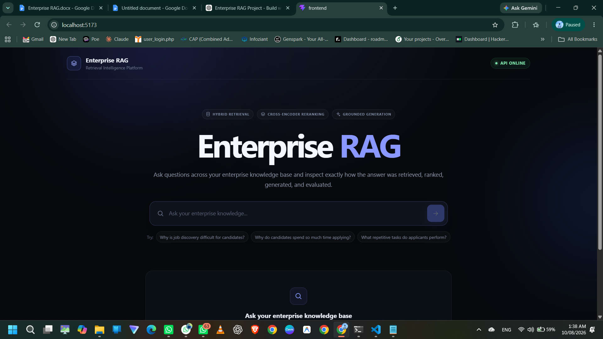
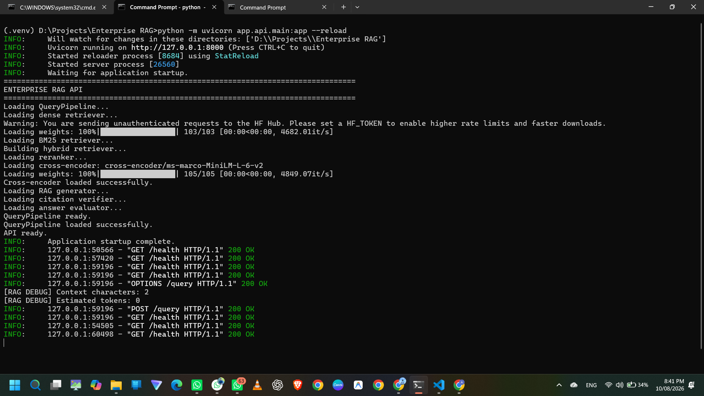
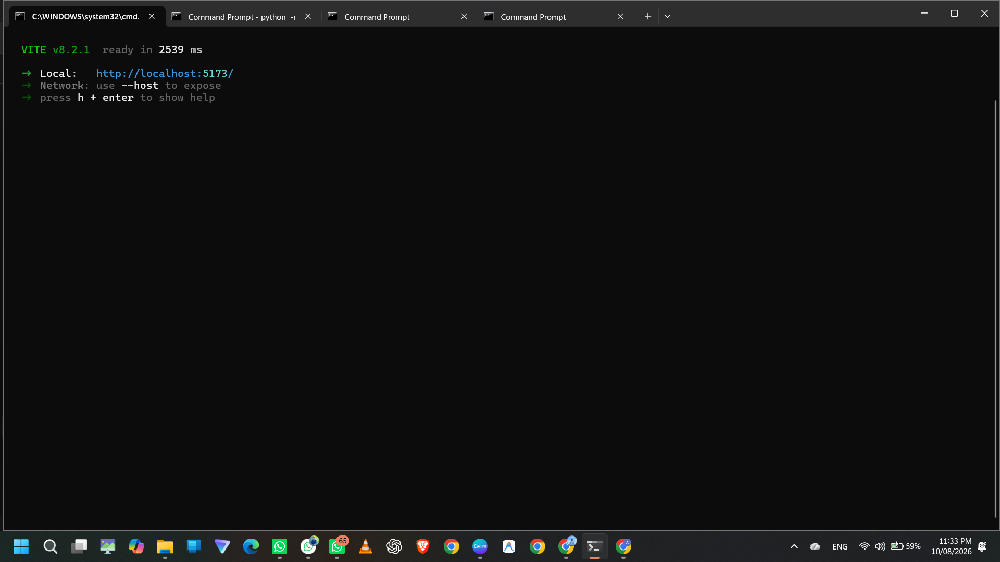
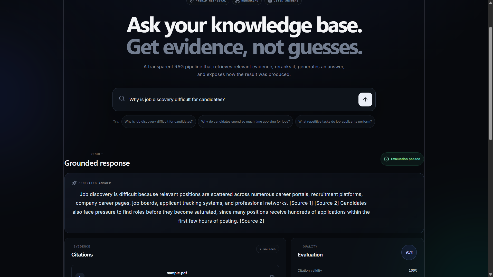
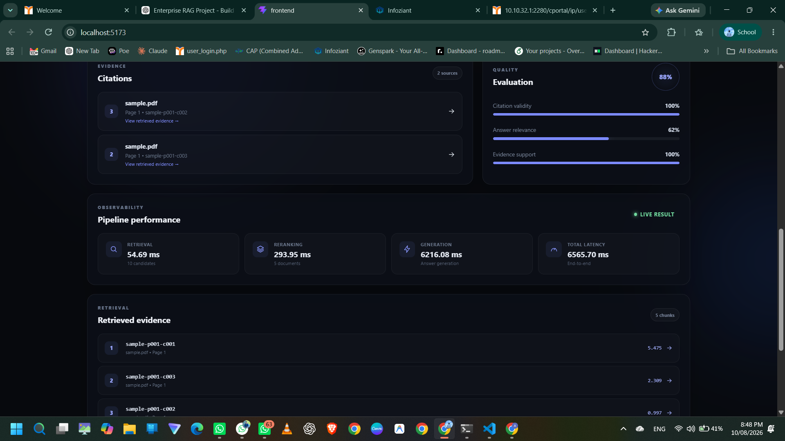
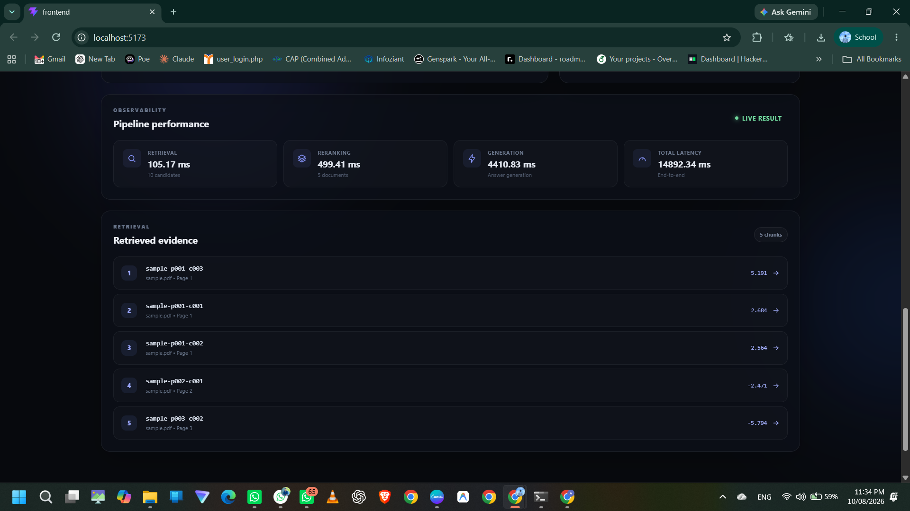

# Enterprise RAG / AI Search

> **Evidence-grounded Retrieval-Augmented Generation system focused on retrieval quality, reranking, citation traceability, faithfulness evaluation, and pipeline observability.**

Enterprise RAG is an AI Search project built to go beyond the typical **"upload a PDF → ask a question"** chatbot.

The system treats retrieval as an engineering problem: documents are represented as searchable chunks, multiple retrieval signals are combined, candidates are reranked, answers are generated from retrieved evidence, citations are mapped back to source metadata, and generated claims are evaluated for faithfulness.

---

## Why this project?

A basic RAG system can retrieve a few vectors and pass them directly to an LLM. That approach can be insufficient for enterprise-style search, where queries may depend on:

- Exact terminology
- Keywords and identifiers
- Acronyms
- Semantic similarity
- Document/page metadata
- Evidence traceability
- Answer grounding

This project therefore separates and measures the major stages of the retrieval pipeline instead of hiding everything behind a single framework.

The central engineering question is:

> **Can better retrieval and ranking produce answers that are more relevant, traceable, and grounded in evidence?**

---

## System Architecture

```text
                         ┌──────────────────────┐
                         │      User Query      │
                         └──────────┬───────────┘
                                    │
                                    ▼
                    ┌─────────────────────────────┐
                    │       Hybrid Retrieval      │
                    │                             │
                    │  ┌──────────┐ ┌──────────┐ │
                    │  │  Dense   │ │  BM25    │ │
                    │  │ Retrieval│ │ Retrieval│ │
                    │  └────┬─────┘ └────┬─────┘ │
                    │       └──────┬──────┘       │
                    │              ▼              │
                    │        Hybrid Fusion        │
                    └──────────────┬──────────────┘
                                   │
                                   ▼
                    ┌─────────────────────────────┐
                    │    Cross-Encoder Reranker    │
                    │   Candidate re-ordering      │
                    └──────────────┬──────────────┘
                                   │
                                   ▼
                    ┌─────────────────────────────┐
                    │      Context Assembly        │
                    │ document / page / chunk      │
                    │ metadata + source content    │
                    └──────────────┬──────────────┘
                                   │
                                   ▼
                    ┌─────────────────────────────┐
                    │       LLM Generation         │
                    │   Evidence-constrained RAG   │
                    └──────────────┬──────────────┘
                                   │
                    ┌──────────────┴──────────────┐
                    ▼                             ▼
          ┌──────────────────┐          ┌────────────────────┐
          │ Citation Mapping │          │ Faithfulness       │
          │ [Source N] →     │          │ Verification       │
          │ document/page/   │          │ claim → evidence   │
          │ chunk metadata   │          └─────────┬──────────┘
          └─────────┬────────┘                    │
                    └──────────────┬─────────────┘
                                   ▼
                         ┌─────────────────────┐
                         │ Evaluation & Metrics│
                         │ relevance / citation│
                         │ faithfulness / time │
                         └─────────────────────┘
```

---

## Current Implementation

### Retrieval

- Dense semantic retrieval
- BM25 lexical retrieval
- Hybrid retrieval
- Configurable candidate and top-k selection

### Ranking

- Cross-encoder reranking
- Larger retrieved candidate set → smaller final context set
- Reranking latency measured independently

### Generation

- Provider-independent generation interface
- OpenRouter-backed LLM client
- Evidence-constrained system prompt
- Strict `[Source N]` citation format
- Explicit insufficient-information behavior

### Citation System

Generated citations are not treated as decorative text.

The system:

1. Extracts `[Source N]` references from the answer.
2. Maps source numbers to the reranked context.
3. Resolves document/page/chunk metadata.
4. Detects invalid citation IDs.
5. Separates citation validity from answer quality.

Example:

```text
Answer:
A high-quality application typically takes 20–60 minutes. [Source 1]

Mapped citation:
Source 1
└── document: sample.pdf
    page: 1
    chunk: sample-p001-c002
```

### Faithfulness Verification

The project includes a semantic evidence verifier.

```text
Generated Claim
      │
      ▼
Extract [Source N]
      │
      ▼
Resolve cited evidence
      │
      ▼
Evidence verification
      │
      ├── Supported
      └── Unsupported
```

The verifier is explicitly instructed to use only the supplied evidence and not outside knowledge.

### Observability

The pipeline records:

- Retrieval latency
- Reranking latency
- Generation latency
- Citation verification latency
- Faithfulness verification latency
- End-to-end latency
- Retrieved document count
- Reranked document count
- Citation validity
- Citation accuracy
- Relevance score
- Faithfulness score
- Supported / unsupported claim counts
- Overall evaluation score

---

## Example Development Run

A representative pipeline execution:

```text
Query
  ↓
10 retrieved candidates
  ↓
5 reranked candidates
  ↓
Context assembly
  ↓
LLM generation
  ↓
Citation mapping
  ↓
Faithfulness verification
  ↓
Evaluation
```

Example development output:

```text
Retrieved documents: 10
Reranked documents: 5

Citations mapped: 3

Faithfulness:
3 / 3 claims supported

Citation validity: 1.00
Citation accuracy: 1.00
Faithfulness: 1.00
Overall score: 0.91
```

> These values are from a development run and are **not benchmark claims**. Final retrieval-quality results will be reported only after a fixed evaluation dataset and controlled experiment are established.

---

## Evaluation Philosophy

The project intentionally separates different dimensions of quality.

| Metric | What it measures |
|---|---|
| Citation validity | Whether `[Source N]` maps to a retrieved source |
| Citation accuracy | Whether the cited evidence supports the claim |
| Faithfulness | Whether generated claims are supported by evidence |
| Relevance | Whether the answer addresses the user's information need |
| Recall@5 | Whether relevant evidence appears in the top five |
| MRR | Rank of the first relevant result |
| nDCG | Ranking quality using graded relevance |
| Latency | Cost of individual stages and the complete pipeline |

The retrieval metrics will be used with a fixed labeled evaluation dataset.

---

## Planned Core Experiment

### Dense Retrieval vs Hybrid Retrieval

Both systems will use the same:

- Corpus
- Evaluation queries
- Relevance judgments
- Evaluation procedure

| Dimension | Dense Baseline | Hybrid System |
|---|---:|---:|
| Semantic retrieval | ✓ | ✓ |
| BM25 retrieval | — | ✓ |
| Hybrid fusion | — | ✓ |
| Reranking | Controlled | Controlled |
| Recall@5 | Measure | Measure |
| MRR | Measure | Measure |
| nDCG | Measure | Measure |
| Latency | Measure | Measure |

The objective is not to assume that hybrid retrieval is better.

Instead, the experiment will measure **where and why** hybrid retrieval helps or fails.

---

## Query Pipeline

```text
QueryPipeline
│
├── DenseRetriever
├── BM25Retriever
├── HybridRetriever
├── CrossEncoderReranker
├── Context Builder
├── RAGGenerator
├── Citation Mapper
├── AnswerEvaluator
├── FaithfulnessVerifier
└── PipelineMetrics
```

The modular design makes it possible to change one retrieval component without rewriting the entire application.

---

## Repository Structure

```text
enterprise-rag/
│
├── app/
│   ├── api/
│   ├── retrieval/
│   │   ├── dense/
│   │   ├── bm25/
│   │   └── hybrid/
│   ├── reranking/
│   ├── query/
│   ├── generation/
│   ├── citations/
│   ├── evaluation/
│   └── observability/
│
├── data/
├── experiments/
├── tests/
├── scripts/
├── configs/
├── frontend/
├── requirements.txt
└── README.md
```

> The repository structure may evolve as additional ingestion, evaluation, and experiment modules are completed.

---

## Technology Stack

| Layer | Technology |
|---|---|
| Backend API | FastAPI |
| Language | Python |
| Dense Retrieval | Sentence-transformers based retrieval |
| Sparse Retrieval | BM25 |
| Hybrid Search | Dense + BM25 fusion |
| Reranking | `cross-encoder/ms-marco-MiniLM-L-6-v2` |
| LLM Gateway | OpenRouter |
| Generation | Evidence-constrained RAG |
| Evaluation | Custom evaluation modules |
| Frontend | React |
| Frontend Icons | Lucide |
| Version Control | Git / GitHub |

---

## Running Locally

### 1. Clone

```bash
git clone https://github.com/eklakhdewan/-ENTERPRISE-RAG.git
cd -ENTERPRISE-RAG
```

### 2. Create virtual environment

Windows:

```bash
python -m venv .venv
.venv\Scripts\activate
```

Linux / macOS:

```bash
python3 -m venv .venv
source .venv/bin/activate
```

### 3. Install dependencies

```bash
pip install -r requirements.txt
```

### 4. Configure environment variables

Create the local environment configuration expected by the project's settings module.

Example:

```env
OPENROUTER_API_KEY=your_key_here
```

**Never commit API keys or secrets to GitHub.**

### 5. Start the backend

```bash
uvicorn app.api.main:app --reload
```

Expected API:

```text
http://127.0.0.1:8000
```

### 6. Start the frontend

From the frontend directory:

```bash
npm install
npm run dev
```

The frontend communicates with the FastAPI `/query` endpoint.

---

## API

### Health Check

```http
GET /health
```

Used by the frontend to determine whether the RAG pipeline is available.

### Query

```http
POST /query
Content-Type: application/json
```

Request:

```json
{
  "query": "Why do candidates spend so much time applying for jobs?"
}
```

The response contains:

- Generated answer
- Mapped citations
- Retrieved evidence
- Evaluation information
- Pipeline metrics

---

## Engineering Principles

### 1. Retrieval is measurable

Retrieval components should be independently evaluated rather than judged only by the final LLM response.

### 2. Citations are evidence links

A citation must resolve to actual retrieved evidence.

### 3. Faithfulness is an evaluation metric

A fluent answer is not automatically a grounded answer.

### 4. Retrieval and generation are separated

```text
Retrieval quality
        ≠
Generation quality
        ≠
Citation quality
        ≠
Faithfulness
```

### 5. Avoid unnecessary orchestration

The core retrieval mechanics remain visible and modular.

### 6. Optimize after measurement

Latency and quality trade-offs should be measured before changing retrieval parameters or models.

---

## Development Status

### Implemented

- [x] Dense retrieval
- [x] BM25 retrieval
- [x] Hybrid retrieval
- [x] Cross-encoder reranking
- [x] Context construction
- [x] Evidence-constrained RAG generation
- [x] Citation extraction
- [x] Citation-to-source mapping
- [x] Citation validity evaluation
- [x] Faithfulness verification
- [x] Relevance evaluation
- [x] Pipeline latency metrics
- [x] FastAPI query interface
- [x] React inspection frontend

### Next

- [ ] Freeze a controlled evaluation corpus
- [ ] Build a labeled evaluation dataset
- [ ] Automate Recall@5 / MRR / nDCG evaluation
- [ ] Run Dense vs Hybrid experiments
- [ ] Analyze retrieval failure cases
- [ ] Evaluate chunking strategies
- [ ] Add systematic token/cost measurement
- [ ] Add query rewriting as a separately evaluated component
- [ ] Expand document ingestion/OCR coverage
- [ ] Improve frontend evidence inspection

---

## What Makes This Different From a Basic RAG Demo?

A basic RAG demo often looks like:

```text
PDF → Embeddings → Vector Search → LLM → Answer
```

This project is designed around:

```text
Documents
   ↓
Structured chunks + metadata
   ↓
Dense retrieval ──────┐
                      ├── Hybrid retrieval
BM25 retrieval ───────┘
   ↓
Cross-encoder reranking
   ↓
Evidence-aware context
   ↓
Grounded LLM generation
   ↓
Citation mapping
   ↓
Citation validation
   ↓
Claim-level faithfulness verification
   ↓
Evaluation + observability
```

The emphasis is on **retrieval engineering and measurable evidence grounding**, not simply integrating an LLM API.

---

## Interview Topics

This project supports discussion around:

- Why combine BM25 with dense retrieval?
- When does lexical retrieval outperform semantic retrieval?
- Why fuse rankings instead of directly combining raw scores?
- Why retrieve more candidates before reranking?
- What is the computational cost of cross-encoder reranking?
- How are citation IDs validated?
- How can citation validity differ from citation accuracy?
- How is faithfulness measured?
- What causes retrieval failures?
- How do chunk size and chunk boundaries affect retrieval?
- How would retrieval scale to a larger corpus?
- How would you reduce LLM latency and token cost?
- How should Dense vs Hybrid retrieval be evaluated fairly?

---

## Future Direction

Potential extensions include:

- Multi-hop query planning
- Table-aware retrieval
- Cross-document evidence aggregation
- Adaptive retrieval weighting
- Online relevance feedback
- Larger-scale evaluation
- Caching and asynchronous execution
- Access-control-aware retrieval
- More systematic quality/cost optimization

---

## Project Positioning

**Enterprise RAG / AI Search** is best presented as a **Retrieval Engineering + LLM Systems project**, rather than a generic chatbot.

It combines:

```text
Information Retrieval
        +
NLP / LLM Engineering
        +
Backend Engineering
        +
Evaluation
        +
Observability
```

The central idea:

> **Don't just generate an answer. Retrieve the evidence, rank it, cite it, verify it, and measure the result.**

---

## Author

**Eklakh Dewan**  
B.Tech — Artificial Intelligence & Data Science

GitHub: https://github.com/eklakhdewan/-ENTERPRISE-RAG

---

## License

This project is currently intended as an educational and engineering portfolio project. Add a formal open-source license if the repository is later released for external reuse.

## Screenshots / Working Proof

The following screenshots document the working application, backend/frontend startup, grounded response generation, citation evaluation, and retrieval observability.

### Application Interface



### Backend API Startup



### Frontend Vite Server



### Grounded Query Response



### Citation Evaluation and Pipeline Performance



### Retrieval Observability and Evidence Ranking



> **Note:** These screenshots are development-run evidence of the implemented pipeline. Performance numbers are runtime observations, not controlled benchmark claims.
