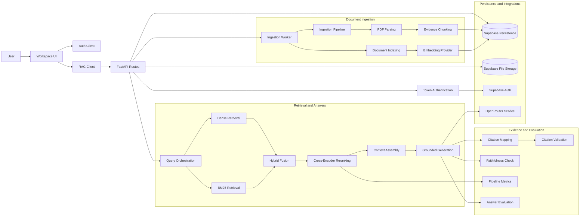

# Enterprise RAG — Architecture

**Status:** Active architecture contract  
**Last reviewed:** 2026-10-05

This document describes the architecture currently implemented or explicitly bounded by the repository. Planned production components are marked as targets rather than completed capabilities.

## 1. Request pipeline

    User Query
        │
        ├───────────────┐
        ▼               ▼
    Dense Retrieval   BM25 Retrieval
        │               │
        └───────┬───────┘
                ▼
          RRF / Hybrid Fusion
                │
                ▼
       Cross-Encoder Reranking
                │
                ▼
          Context Assembly
       document/page/chunk metadata
                │
                ▼
     Evidence-Constrained Generation
                │
          ┌─────┴─────┐
          ▼           ▼
    Citation Mapping  Faithfulness Verification
          │           │
          └─────┬─────┘
                ▼
        Evaluation + Observability

## 2. Repository architecture map

The repository-level architecture connects the application boundary, ingestion pipeline, persistence/integrations, retrieval pipeline, generation provider, and evidence/evaluation layer:

This visualization is the repository map; the sections below define the behavior and boundaries of each layer.

## 2. Retrieval layer

The retrieval layer exposes independent signals:

- **Dense retrieval** for semantic similarity.
- **BM25** for lexical overlap, terminology, identifiers, acronyms, and exact phrases.
- **Hybrid/RRF** for rank-based fusion without requiring raw-score calibration.
- **Cross-encoder reranking** for query-document interaction over a bounded candidate set.

Each stage remains independently replaceable and measurable.

## 3. Evidence model

Retrieved chunks retain provenance required for inspection and evaluation:

- document identity;
- page;
- section where available;
- stable chunk ID;
- character span;
- source content.

The golden benchmark also records durable document/page/character-span references so relevance judgments can survive chunk-ID changes when possible.

## 4. Generation boundary

The generation layer uses a provider-independent interface with an OpenRouter-backed implementation.

The contract is:

1. generate from supplied evidence;
2. use the repository citation format;
3. avoid unsupported claims;
4. return an insufficient-evidence response when the corpus cannot support the answer.

Retrieved document content is treated as **data**, not instructions.

## 5. Citation boundary

    [Source N]
        ↓
    Retrieved context entry
        ↓
    Document / page / chunk metadata
        ↓
    Citation validity + accuracy checks

- **Validity:** the citation resolves to a retrieved source.
- **Accuracy:** the resolved evidence supports the associated claim.

## 6. Faithfulness boundary

Faithfulness verification runs after answer generation and citation mapping.

    Generated claim
          ↓
    Referenced evidence
          ↓
    Evidence verification
       ┌──┴────────┐
    Supported   Unsupported

The verifier is intended to judge supplied evidence rather than introduce outside knowledge.

## 7. Observability

The pipeline records stage-level and end-to-end measurements for retrieval, reranking, generation, citation verification, faithfulness verification, counts, and evaluation signals.

Development measurements are diagnostic. They become benchmark evidence only when produced by the frozen evaluation workflow.

## 8. Production boundary

Production persistence and tenant-aware infrastructure are a later release track. The current milestone remains local-first retrieval engineering.

Target topology:

    React/Vite
        ↓ HTTPS + user auth context
    Long-running FastAPI / inference service
        ├── retrieval orchestration
        ├── embeddings
        ├── reranking
        └── generation
        │
        ├── Supabase Auth
        ├── Postgres / pgvector
        └── private Storage
        ↑
    Long-running ingestion worker

Production release is gated by:

- frozen retrieval benchmark;
- FAISS-vs-pgvector parity evidence;
- authenticated request-path isolation tests;
- reliable ingestion and chunk replacement;
- production BM25 lifecycle;
- target-runtime resource measurements.

## 9. Security constraints

1. Tenant scope must be established before retrieval.
2. Ordinary user operations should carry user authorization context so RLS can enforce ownership.
3. Service-role credentials are restricted to trusted worker/admin operations.
4. Retrieved documents are untrusted input and remain separated from system instructions.
5. Secrets never enter frontend VITE_* variables.

## 10. Design principles

- Retrieval is measurable.
- Evidence is first-class.
- Components remain replaceable.
- Production claims require production evidence.
- Optimization follows measurement.
